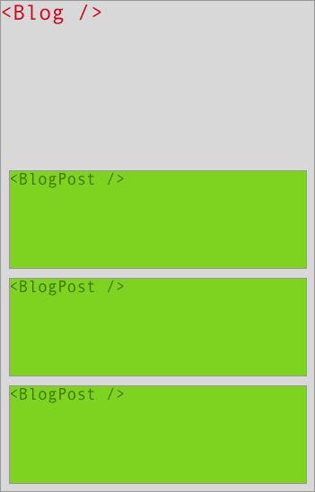
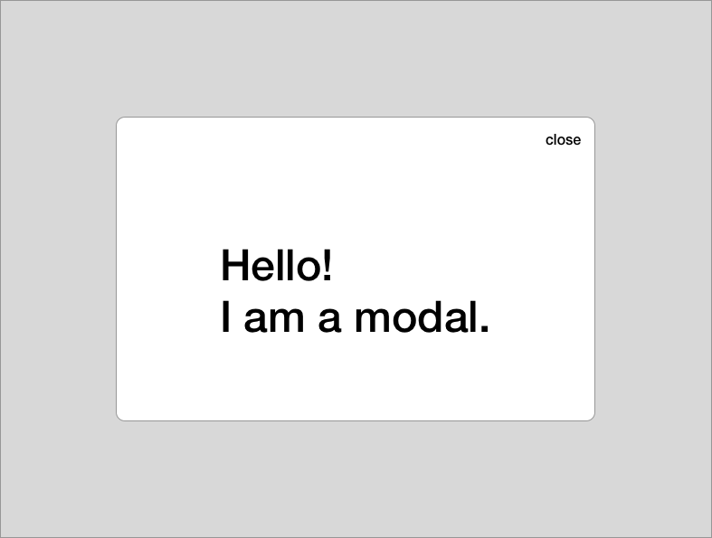

# React Changing State

## Overview

React allows you to structure your application using small, reusable components,
but React isn't really just about creating static pages, it's about building
**react**ive user interfaces that enable you to coordinate complex user
interactions.

In this lesson we will be learning about how you can update the state of
components. You are going to learn about the difference between `state` and
`props` and what happens when state changes in your application occur.

## State vs Props

Managing state is hard. React allows you to encapsulate two different "kinds" of
state: "internal" state that can only be mutated and accessed by the component
that manages it (`state`) and "external" state that gets passed down to the
component that renders it (`props`). This sounds way more complicated than it
actually is, so let's take a step back and look at a simple example: A blog. The
following examples are going to concentrate on a `Blog` component that renders
multiple `BlogPost`s. Visually, this might look something like this:



### Pure Components

React is all about rendering _stuff_: A React component takes some data, builds
some virtual representation of how our DOM is *supposed* to look like and
returns it:

```js
class BlogPost extends React.Component {
    render () {
        return (
            <article>
                <h1>{this.props.title}</h1>
                <p>{this.props.body}</p>
            </article>
        )
    }
}
```

The above `BlogPost` component renders an article consisting of a `title` and
`body`. Those are being passed down as `props`. So whenever we want to re-use
the `BlogPost` component, we can simply give it a `title` and `body`:

```js
class Blog extends React.Component {
    render () {
        return (
            <div>
                <BlogPost title={'Hello World!'} body={'Hello, this is my blog.'} />
                <BlogPost title={'Good bye!'} body={'I\'m busy. I\'m shutting this blog down.'} />
            </div>
        )
    }
}
```

This is incredibly powerful, since it allows us to gradually remove complexity
by re-structuring our application into smaller, easier to test units.

The above component only consists of a `render` function, it doesn't have any
**internal** state. You give it some data and it renders a component. **That's
it.** Because it only accepts props and only _exists_, we can write this
component as a simple (arrow) function:

```js
class BlogPost extends React.Component {
    render () {
        return (
            <article>
                <h1>{this.props.title}</h1>
                <p>{this.props.body}</p>
            </article>
        )
    }
}
```

is equivalent to:

```js
function BlogPost (props) {
    return (
        <article>
            <h1>{this.props.title}</h1>
            <p>{this.props.body}</p>
        </article>
    )
}
```

which can also be written as an arrow function:

```js
const BlogPost = props =>
    <article>
        <h1>{props.title}</h1>
        <p>{props.body}</p>
    </article>
```

or using destructured props:

```js
const BlogPost = ({title, body}) =>
    <article>
        <h1>{title}</h1>
        <p>{body}</p>
    </article>
```

Because the above component can be written as a single function that doesn't
rely on any **internal state** or component-lifecycle (more on that later), we
call those components _pure_ and _stateless_. **Purity** is an important concept
in programming and not something specific to React. A function can be considered
to be _pure_ if — and only if — it:

1. always returns the same result when called with the same arguments:

    In other words, `<BlogPost title={'My title'} body={'My body'} />` is always
    going to _return_ the exact same result. It doesn't matter when or "where"
    we render the component: The only aspect that the component itself cares
    about are its props.

2. doesn't have any side effects:

    Typically, your component's `render` function shouldn't have any fancy logic
    that starts your coffee machine or loads data from your API. In functional
    programming, when we talk about "side effects", we mean mutation of some
    form of external state. Sounds fancy, but essentially it means pure
    functions can't load data from an API or update some global variable (such
    as `localStorage`).

### Internal State

As we just saw, props can be seen as arguments for pure components. Pure
components don't rely on any internal state or side-effects: They simply return
a virtual representation of how they want to "look" like.

There is only one problem: props are always being "passed down" from the
component's immediate ancestor. So for example, the `Blog` component passes the
blog post data to the `BlogPost` component. But where does the blog *data*
actually come from?

```js
class Blog extends React.Component {
    render () {
        return (
            <div>
                <BlogPost title={'Hello World!'} body={'Hello, this is my blog.'} />
                <BlogPost title={'Good bye!'} body={'I\'m busy. I\'m shutting this blog down.'} />
            </div>
        )
    }
}
```

In the above example, we simply hard-coded the blog titles and bodies. Obviously
this isn't really what we want, otherwise we might as well just render
everything on the server — not very *reactive* at all.

Instead we typically want to dynamically load the data from some API endpoint,
for instance `GET /api/posts`. So whenever we render a new blog component, we
do a XHR call and load the blog posts that we want to render.

In React, the function that gets executed once a component has been "rendered"
(= created) is called `componentDidMount`. `componentDidMount` is a lifecycle
method, as such it is **not** available for pure components (such as the
`BlogPost` component that we defined using an arrow function):

```js
class Blog extends React.Component {
    componentDidMount () {
        fetch('http://localhost:4000/api/posts')
            .then(response => response.json())
            .then(posts => {
                console.log('Yey! I got some posts!', posts)
            })
    }
    render () {
        return (
            <div>
                <BlogPost title={'Hello World!'} body={'Hello, this is my blog.'} />
                <BlogPost title={'Good bye!'} body={'I\'m busy. I\'m shutting this blog down.'} />
            </div>
        )
    }
}
```

This means that whenever we `mount` this component by rendering it as a child of
some other part of our application, e.g. using `<Blog />`, React executes the
`componentDidMount` method that requests data from our API.

Once we receive those blog posts, we `console.log` them. While
`console.log`ging them is certainly fun, our users won't be too happy about
having to open the Chrome DevTools in order to read our blog. So instead of just
printing them to the console, the `Blog` component should somehow "keep track
of them".

The most intuitive solution would be to "set" them as a property on the
component. React provides a method for that called... `setState`! `setState`
allows components to keep track of their **internal** state.

So let's change our component to update the state of the blog component once we
receive the requested blog posts from our API:

```js
    componentDidMount () {
        fetch('http://localhost:4000/api/posts')
            .then(response => response.json())
            .then(posts => {
                console.log('Yey! I got some posts!', posts)

                // Let's update the state here:
                this.setState({ posts: posts })

                // or shorter: this.setState({ posts })
            })
    }
```

Now that we updated the component's state using `setState`, we want to render
our posts using the `BlogPost` component, so we need to update our component's
render method:

```js
    render () {
        return (
            <div>
                {
                    this.state.posts.map((post) =>
                        <BlogPost title={post.title} body={post.body} />
                    )
                }
            </div>
        )
    }
```

Keep in mind that we didn't change the `BlogPost` component *at all* — ideally
you should try to keep the majority of your components "stateless".

At this point, you might wonder why we had to use `setState`, if all `setState`
does is... well... setting `this.state`. There is a very simple reason for that:

React needs to "know" that a state change happened, since whenever a component's
"data" (state or props) changes, React has to re-render the component (runs its
render function to figure out "what changed").

### State vs Props

At this point you might wonder when to use `props` and when to use `state`, but
there is a good rule of thumb when laying out your application's architecture:

* Use `state` for adding interactivity to your component:

    A dropdown menu for example can be in an `expanded` or `collapsed` state, a
    modal dialog can be `open` or `closed`.

* Move your state "up":

    In our blog example, the `BlogPost` component could also "manage" its own
    state by doing a separate XHR request. Nevertheless, this is not an elegant
    solution, since the blog needs to "know" about the blog posts anyways (how
    else would it "decide" how many `<BlogPost />` components should be
    rendered in the first place?).

    Moving **application state** higher up generally speaking simplifies the
    architecture of your application and allows you to keep the majority of your
    components stateless.

    State is hard to manage and difficult to test. You should always try to keep
    your components as pure as possible.

* Start with props:

    When creating the layout of your project, you typically start with a static
    version and then add interactivity once you reach a certain point.

    During this initial phase, there is almost never a need for state.
    Everything can be done using props during those initial minutes. Try to keep
    your components as encapsulated and isolated as possible while you're
    gradually adding interactivity to individual parts of your application.

    For our `<Blog />` example, we first hardcoded the `<BlogPost />`
    component's props and then added an API call that updated the `Blog`
    component's state.

In general, it's usually a good idea to start with a rather static version of
your application, in which all data is being rendered by gradually passing down
`props` to child components. Then — as a next step — you can add custom user
interactions to your app, e.g. what happens when a user presses this button?
Should it open a dialog by doing `this.setState({dialogOpen: true})`?

## `setState` in detail

Now that we built our blog, let's have a look at something something a bit more
interesting: A modal.



Let's first start off laying out our component structure:

```js
class App extends React.Component {
    render () {
        return (
            <div>
                <Modal />
            </div>
        )
    }
}
```

A modal can either be open or closed, so our application needs to keep track of
that. The `<Modal />` component itself only _knows_ whether or not it is open,
it can't "open" itself — instead it has to expose some API for other components
for opening it.

Therefore we need to keep track of whether or not the modal is open in its
parent component. In this case, that's the `<App />` component. On page load,
the modal shouldn't be open. The initial state of the modal is closed
(`isModalOpen = false`). We can initialize a component's state in its
constructor:

```js
class App extends React.Component {
    constructor (props) {
        super(props)
        this.state = {
            // modal should be closed on page load
            isModalOpen: false
        }
    }
    // ...
}
```

We then need to "tell" the `<Modal />` component whether or not it is open. The
only way to communicate with the component is via its `props`. In this case,
we would add a new `isOpen` prop to the `Modal` component:

```js
class App extends React.Component {
    // ...
    render () {
        return (
            <div>
                <Modal isOpen={this.state.isModalOpen} />
            </div>
        )
    }
}
```

Obviously our users are going to be very disappointed if they aren't able to
open the popup, so let's add a separate button that triggers the modal:

```js
class App extends React.Component {
    // ...
    openModal () {
        this.setState({ isModalOpen: true })
    }
    render () {
        return (
            <div>
                <button onClick={this.openModal}>Open the modal!</button>
                <Modal isOpen={this.state.isModalOpen} />
            </div>
        )
    }
}
```

Now if we click the `Open the modal!` button, we update the `<App />`
component's internal state, thus enforcing an update on the `<App />` component.

Since `this.state.isModalOpen` evaluates to `true` now, the modal is being
opened:

```js
    render () {
        return (
            <div>
                <button onClick={this.openModal}>Open the modal!</button>
                <Modal isOpen={true} />
            </div>
        )
    }
```

But what does our modal component actually look like? Up until now, we didn't
talk about the `<Modal />` component's render method.

As we just saw, the modal accepts an `isOpen` prop, which it then uses in order
to add an `modal--is-open` class to its container:

```js
const Modal = ({ isOpen }) =>
    <div className={isOpen ? 'modal modal--is-open' ? 'modal'}>
        <button>close</button>

        <p>Hello! I am a modal.</p>
    </div>
```

Perfect! Now we can simply specify whether or not the modal is open using its
`isOpen` prop.

As you might have noticed, the modal also has a "close" button. Currently it
doesn't do anything, so let's think about what should happen if the close button
is being pressed:

1. The user clicks the close button.
2. The `<Modal />` component needs to update the `<App />` component's
    `isModalOpen` state.

For convenience, we're now going to add a `closeModal` method on the `<App />`
components:

```js
class App extends React.Component {
    // ...
    openModal () {
        this.setState({ isModalOpen: true })
    }
    closeModal () {
        this.setState({ isModalOpen: false })
    }
    // ...
}
```

The `<Modal />` component now needs to be able to call the `<App />` component's
`closeModal` method. But React components can't directly access their ancestors,
so instead we have to pass the `App`'s `closeModal` method as a handler to the
`Modal`:

```js
const Modal = ({ isOpen, onClose }) =>
    <div className={isOpen ? 'modal modal--is-open' ? 'modal'}>
        <button onClick={onClose}>close</button>

        <p>Hello! I am a modal.</p>
    </div>
```

```js
class App extends React.Component {
    // ...
    render () {
        return (
            <div>
                <button onClick={this.openModal}>Open the modal!</button>
                <Modal isOpen={this.state.isModalOpen} onClose={this.closeModal}/>
            </div>
        )
    }
    // ...
}
```

And that's it! Now the modal is able to communicate with the `<App />` by
calling the passed in handler.

There is only one problem: When we click `close`, we get the following error:

```
TypeError: onClose is not a function
```

Uh? That's a bit weird. What happened?

We forgot to bind our handler functions! Typically you would bind all you
component's public methods in the constructor (click handlers etc.):

```js
class App extends React.Component {
    constructor (props) {
        super(props)
        this.state = {
            // modal should be closed on page load
            isModalOpen: false
        }
        this.openModal = this.openModal.bind(this)
        this.closeModal = this.closeModal.bind(this)
    }
    // ...
}
```

Now everything works as expected. Good job, you just implemented a React modal!

**Advanced:** If you're looking for an actual React modal to use in your
production application, [`react-modal`](https://github.com/reactjs/react-modal)
has a very similar API to the component we just implemented.

## Resources

- [React: Communicate Between Components](https://facebook.github.io/react/tips/communicate-between-components.html)
- [Autobinding, React and ES6 Classes](http://www.ian-thomas.net/autobinding-react-and-es6-classes/)
